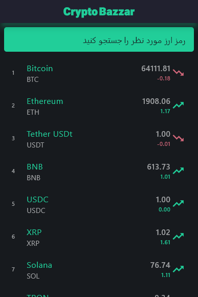

# 💰 Crypto Bazaar

A Flutter cryptocurrency tracking application that retrieves cryptocurrency market data from APIs and presents prices and market information through a clean and user-friendly interface.

## ✨ Features

* 📊 Display cryptocurrency market data
* 💰 Show current cryptocurrency prices
* 🔄 Fetch data from REST APIs
* 🌐 API integration using HTTP and Dio
* ⚡ Loading states with Flutter Spinkit
* 📱 Clean and responsive Flutter UI
* 🎨 Custom typography and UI components
* 🚀 Built with Flutter & Dart

## 🛠️ Tech Stack

| Technology        | Usage                             |
| ----------------- | --------------------------------- |
| 💙 Flutter        | Cross-platform mobile development |
| 🎯 Dart           | Programming language              |
| 🌐 REST API       | Cryptocurrency market data        |
| 🔗 Dio            | HTTP client and API requests      |
| 📡 HTTP           | Network requests                  |
| ⏳ Flutter Spinkit | Loading animations                |

## 📂 Project Structure

```text
lib/
├── constans.dart       # App constants
├── crypto.dart         # Cryptocurrency data/model
├── cryptopage.dart     # Cryptocurrency page
├── homepage.dart       # Main application screen
└── main.dart           # Application entry point
```

## 🖼️ Screenshots

<div align="center">

<table>
<tr>
<td></td>
<td></td>
</tr>
<tr>
<td></td>
<td></td>
</tr>
</table>

</div>

## 🚀 Getting Started

### 1️⃣ Clone the repository

```bash
git clone https://github.com/MobinaFetrati/flutter_crypto_bazzar.git
```

### 2️⃣ Navigate to the project

```bash
cd flutter_crypto_bazzar
```

### 3️⃣ Install dependencies

```bash
flutter pub get
```

### 4️⃣ Run the application

```bash
flutter run
```

## 🔌 API Integration

The application communicates with external cryptocurrency APIs to retrieve market information and display it inside the Flutter application.

Network communication is handled using packages such as **Dio** and **HTTP**.

## 🎯 Project Purpose

This project was developed to practice and demonstrate:

* Flutter UI development
* REST API integration
* Asynchronous data handling
* Working with external data sources
* Building cryptocurrency-related mobile interfaces
* Creating clean and responsive application screens

## 👩‍💻 Developer

**Mobina Fetrati**

Flutter Developer | Mobile Application Developer

[GitHub](https://github.com/MobinaFetrati)
